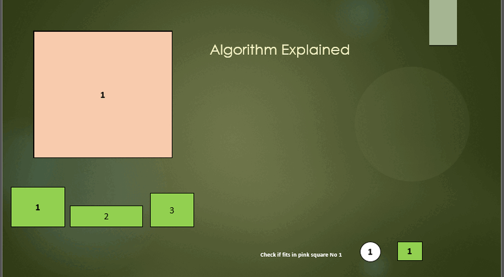
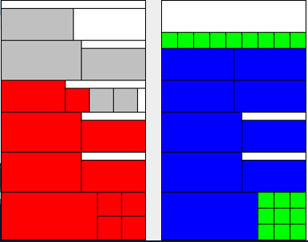

# Tree-Based 2-Dimensional Bin Packing System

## Overview

This project implements a **2-dimensional bin packing system** using a **tree-based** structure for efficiently placing items into bins. The algorithm splits nodes representing available space in the bin, places items within those nodes, and recursively manages the layout to maximize space utilization. The system ensures optimal item packing by leveraging a dynamic, tree-like node structure to handle multiple items and bins.

## Key Features

- **Node-based Bin Structure**: The bin is modeled as a tree where each node represents a sub-region. Nodes are split as items are packed, creating a flexible structure for placing items.
- **2D Bin Packing**: Items are placed in bins by considering both width and height dimensions. The system can handle rectangular shapes and optimize space efficiently.
- **Recursive Node Splitting**: The system splits nodes when an item is placed, recursively creating sub-nodes to accommodate future items.
- **Item Placement Strategy**: Items are placed either upright or sideways based on available space.
- **Multiple Bins Support**: If a bin is full, new bins are created, and remaining items are packed into the new bins.

## Methodology

### 1. **Recursive Depth-First Search (DFS)-like Traversal**
   The core of the algorithm is a **DFS-like recursive traversal** that searches for available space within a bin. The algorithm starts at the root node and recursively explores child nodes to find suitable areas for placing items.

### 2. **Node Splitting (Recursive)**
   Once an item is placed into a node, that node is split into two sub-nodes: one to the right and one above, maintaining available space for further packing. This recursive splitting ensures that space is efficiently utilized across the bin.

### 3. **Tree Merging**
   When new nodes are created through splitting, they are merged back into the bin's tree structure to maintain a continuous layout and optimize space usage.

### 4. **Recursive Traversal for Closed Lines**
   The program uses a **recursive traversal** of nodes to track closed lines and other packing optimizations during the bin packing process.

### Algorithm Explanation:

Below is a visual representation of the algorithm at work. It shows how the bin is split recursively to accommodate items and the placement strategy used to optimize the packing process.

## How It Works

1. **Loading Items**: Items are loaded from an external data file and stored in a list for processing.
2. **Pallets (Bins)**: The bins are created based on specified dimensions, and the system attempts to place items into them.
3. **Item Placement**: The algorithm places each item either upright or sideways, depending on available space.
4. **Node Splitting**: After an item is placed, the node is split into smaller regions to accommodate additional items.
5. **Multiple Bins**: If one bin is filled, a new bin is created, and the remaining items are packed into the next bin.
6. **Recursive Tree Traversal**: The system recursively checks each node to ensure that all items are efficiently packed into the available bins.

### Packing Results:

The image below shows the final packing results, visualizing how items are placed in the bins after the packing algorithm has been executed.

## Bibliography

- Martello, S., & Toth, P. (1990). *Knapsack problems: Algorithms and computer implementations*. John Wiley & Sons, Inc.
- Ramos, J. G., & Gremillion, F. E. (2022). *A strategic tool for finding optimal last mile fleet size & fleet composition, using knapsack, bin packing, and aggregate planning*. Massachusetts Institute of Technology.
- Han, W., Bennell, J. A., Zhao, X., & Song, X. (2013). Construction heuristics for two-dimensional irregular shape bin packing with guillotine constraints. *European Journal of Operational Research, 230*(3), 495-504. https://doi.org/10.1016/j.ejor.2013.03.046
- Bujtás, C., Dósa, G., Imreh, C., Nagy-György, J., & Tuza, Z. (2011). The graph-bin packing problem. *International Journal of Foundations of Computer Science, 22*(1), 17-34. https://doi.org/10.1142/S0129054111007724

